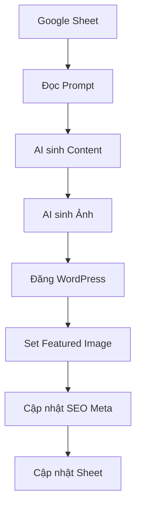

# 🇵🇭 Philippines AI Content Processor

[](https://python.org)
[](https://openai.com)
[](https://openai.com)
[](https://mysql.com)

## 🎯 **PROJECT OVERVIEW**

**Advanced AI Content Processing Pipeline** specialized for **Philippines casino market** with multi-site deployment capabilities.

## 📋 Yêu cầu hệ thống

- Windows 10/11
- Python 3.10+
- Kết nối Internet
- Tài khoản Google (cho Google Sheets API)
- Website WordPress với REST API enabled
- API keys: OpenAI và/hoặc Google Gemini

## 🚀 Cài đặt

### 1. Chuẩn bị môi trường Python

```bash
# Đã tự động tạo virtual environment
# Các thư viện đã được cài đặt sẵn
```

### 2. Cấu hình API keys

Chỉnh sửa file `.env`:

```env
# API Keys
OPENAI_API_KEY=sk-your-openai-key-here
GEMINI_API_KEY=your-gemini-key-here

# WordPress
WP_URL=https://yoursite.com
WP_USERNAME=your_wp_username
WP_PASSWORD=your_wp_app_password

# Google Sheets
GOOGLE_SHEET_ID=your-google-sheet-id
```

### 3. Chuẩn bị Google Service Account

1. Truy cập [Google Cloud Console](https://console.cloud.google.com/)
2. Tạo project mới hoặc chọn project có sẵn
3. Enable Google Sheets API và Google Drive API
4. Tạo Service Account
5. Download file JSON credentials và đặt tên `creds.json` vào thư mục project

### 4. Chuẩn bị WordPress

1. Đảm bảo WordPress có REST API enabled
2. Tạo Application Password:
   - Vào WordPress Admin → Users → Profile
   - Tại phần "Application Passwords", tạo password mới
   - Sử dụng username và app password này trong file `.env`

### 5. Chuẩn bị Google Sheet

Tạo Google Sheet với cấu trúc sau:

| A (Prompt) | B (Status) | C (Title) | D (Content) | E (WP_URL) | F (Image_URL) | G (Meta_Title) | H (Meta_Desc) | I (Created_Date) | J (Error_Log) |
|------------|------------|-----------|-------------|------------|---------------|----------------|---------------|------------------|---------------|
| Viết bài về AI | pending |  |  |  |  |  |  |  |  |

## 📖 Cách sử dụng

### Chạy tự động (Batch)

Nhấp đúp vào `run_batch.bat` để xử lý tất cả hàng pending trong Google Sheet.

### Chạy tương tác

Nhấp đúp vào `run_interactive.bat` để chạy chế độ menu tương tác.

### Thiết lập dữ liệu mẫu

Nhấp đúp vào `setup_sample.bat` để tạo header và dữ liệu mẫu trong Google Sheet.

### Chạy từ Command Line

```bash
# Xử lý tất cả hàng
python main.py batch

# Xử lý tối đa 5 hàng
python main.py batch 5

# Xử lý 1 hàng
python main.py single

# Thiết lập dữ liệu mẫu
python main.py setup

# Chế độ tương tác
python main.py
```

## 🔧 Cấu hình nâng cao

### File `config.py`

```python
# Số bài xử lý đồng thời
CONCURRENT_REQUESTS = 3

# Delay giữa các request (giây)
REQUEST_DELAY = 2

# Độ dài tối đa của content
MAX_CONTENT_LENGTH = 2000

# Kích thước ảnh AI
IMAGE_SIZE = "1024x1024"
```

## 📊 Luồng xử lý



## 🔍 Troubleshooting

### Lỗi kết nối Google Sheets
- Kiểm tra file `creds.json` có đúng format
- Đảm bảo Service Account có quyền truy cập Google Sheet
- Kiểm tra GOOGLE_SHEET_ID trong `.env`

### Lỗi WordPress API
- Kiểm tra WP_URL có đúng format (https://domain.com)
- Đảm bảo Application Password được tạo đúng cách
- Kiểm tra REST API có enabled không

### Lỗi AI API
- Kiểm tra API keys có hợp lệ
- Kiểm tra quota/credit còn đủ không
- Thử switch giữa OpenAI và Gemini

## 📝 Log và Monitoring

- Tất cả trạng thái được ghi vào cột Status trong Google Sheet
- Lỗi chi tiết được ghi vào cột Error_Log
- Console output hiển thị tiến trình realtime
- Thống kê cuối hiển thị tổng quan kết quả

## ⚡ Performance Tips

- Tăng `CONCURRENT_REQUESTS` nếu server mạnh
- Giảm `REQUEST_DELAY` nếu APIs không rate limit
- Sử dụng batch processing cho nhiều bài
- Chạy vào giờ ít traffic để tăng tốc độ

## 🛡️ Bảo mật

- Không commit file `.env` lên Git
- Giữ file `creds.json` bí mật
- Sử dụng Application Password thay vì password chính
- Định kỳ rotate API keys

## 📞 Hỗ trợ

Nếu gặp vấn đề, kiểm tra:
1. File log trong console
2. Cột Error_Log trong Google Sheet
3. WordPress debug logs
4. API status pages (OpenAI, Google)

## 🎉 Tính năng nâng cao (Coming Soon)

- [ ] Hỗ trợ nhiều ngôn ngữ
- [ ] Template content có sẵn
- [ ] Tích hợp Yoast SEO
- [ ] Lên lịch đăng bài
- [ ] Dashboard web interface
- [ ] Analytics và báo cáo

---

💡 **Tip**: Bắt đầu với vài bài test trước khi chạy batch lớn!
